-Práctica 2.3. Ejercicio Práctico: Uso de Comandos de Git y Gitflow (1.5 puntos)

-C1 (master): Primer commit del proyecto. Este commit añade la base del proyecto en el repositorio. (Tag: versión v1.0.0).

Primero hemos realizado un git init para inbicializar el repositorio de git seguimos con la creacion de la estructura inicial del proyecto donde hemos agregado los ficheros index.html, app.js, y README.md.

Lo siguiente que hicimos fue añadir todos los archivos al area de staging y realizamos el primer commit y creamos el primer tag v1.0.0

Creamos el repositorio privado en GitHub y se añadio como remoto y hicimos push de master y del tag de Github.

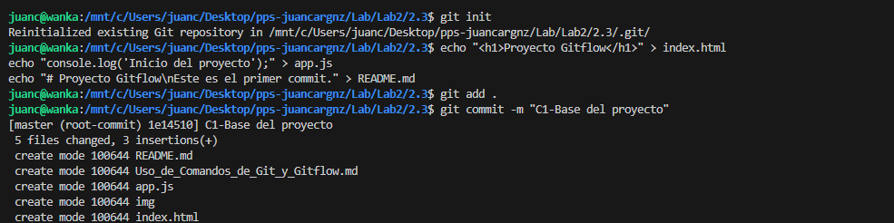

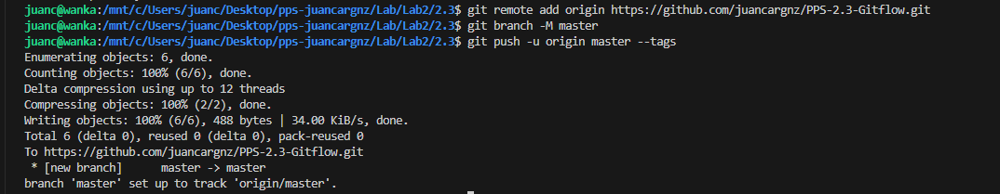

-C2 (develop): Creación de la rama develop. 

Primero hemos creado la rama developy hecho una modificacion inicial para diferenciar master de develop.

Hemos realizado commit y la subida de la rama al repositorio remoto

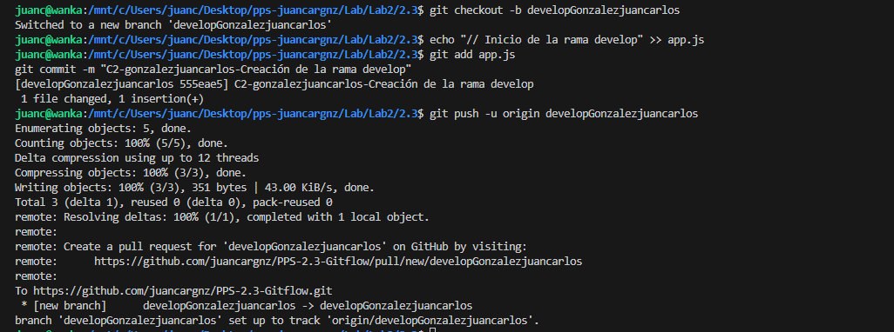

-C3.Creación de una rama para añadir gráficos en la página de los trabajadores (creado por Programador Nº 2).

Primero creamos la rama feature y ahora simulamos que somos el programador 2 y comprobamos nombre e email.

Modificamos la funcionalidad de graph_employee, realizamos un commit y la subida de la rama a remoto.

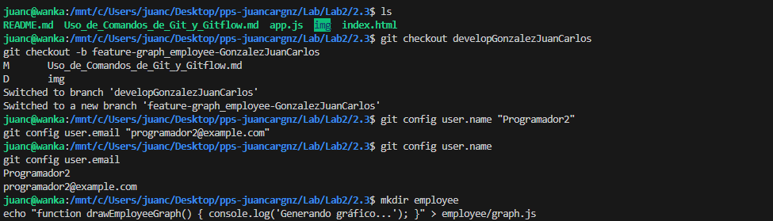
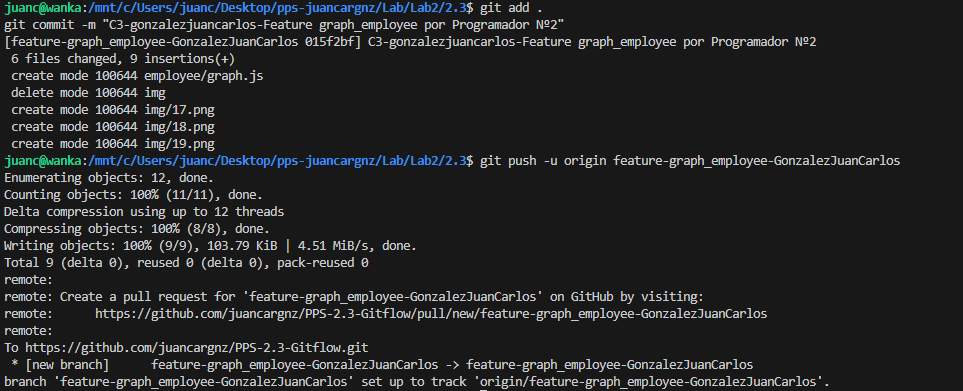

-C4.Creación de una rama para gestionar el caso en que un trabajador introduzca un valor negativo en una tarea.

Hemos cambiado de rama master, creado la rama hotfix e implementamos el parche.

Hacemos commit al parche,subimos la rama a hotfix al repositorio remoto y verificamos visualmente la rama en Github.

Ha cambiado Github y no puedes obtener network si no es público

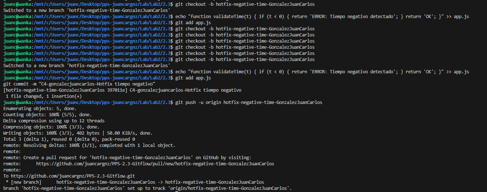
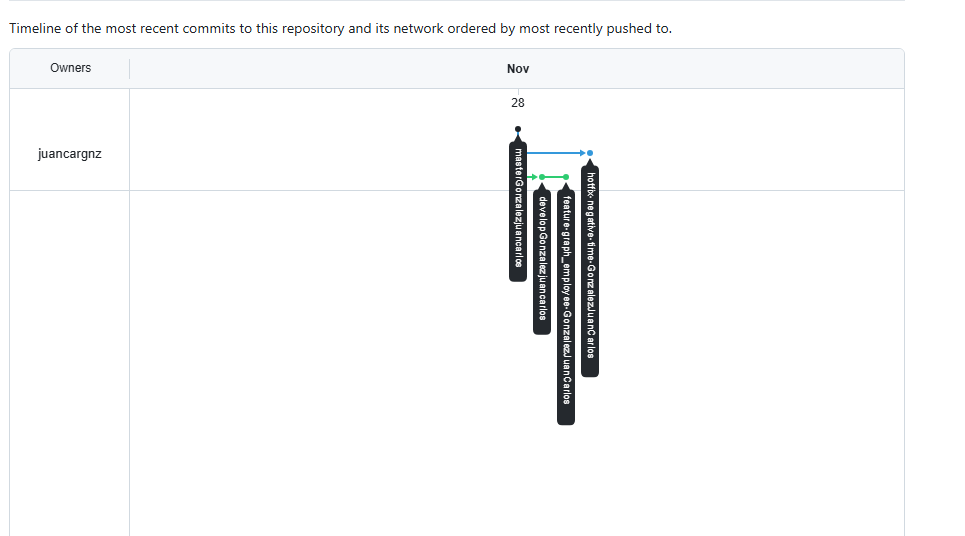

-C5 (master): Integración del parche en la rama master. (Tag: versión v1.0.1).

Aqui lo que he realizado es el cambio a la rama master un merge con --no-ff que lo que hace es mantener un commit en visibley preservar la historia completa del hotfix entre otras cosas.

He creado el tag v1.0.1 es decir hemos actualizado la version inicial y la hemos subido al repositorio.

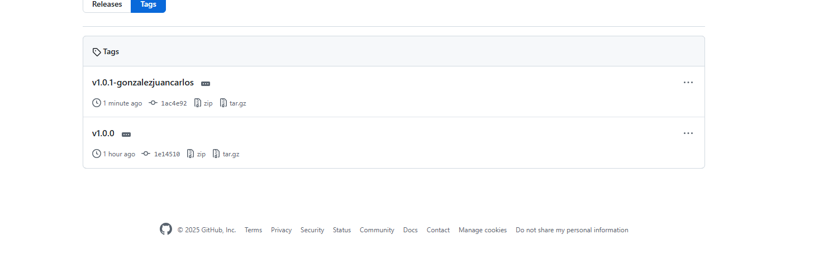
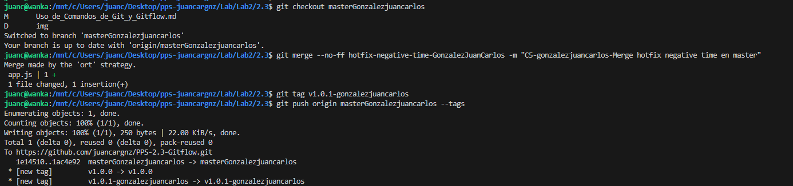

-C6 (develop): Integración del parche en la rama develop.

Para la integracion del parche hemos tenido un conflicto en app.js lo hemos solucionado quitando el head y hotfix y hemos realizado un commit y un push.

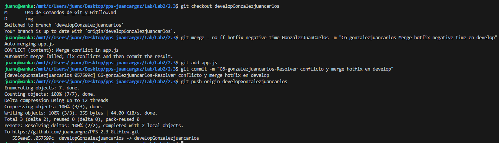
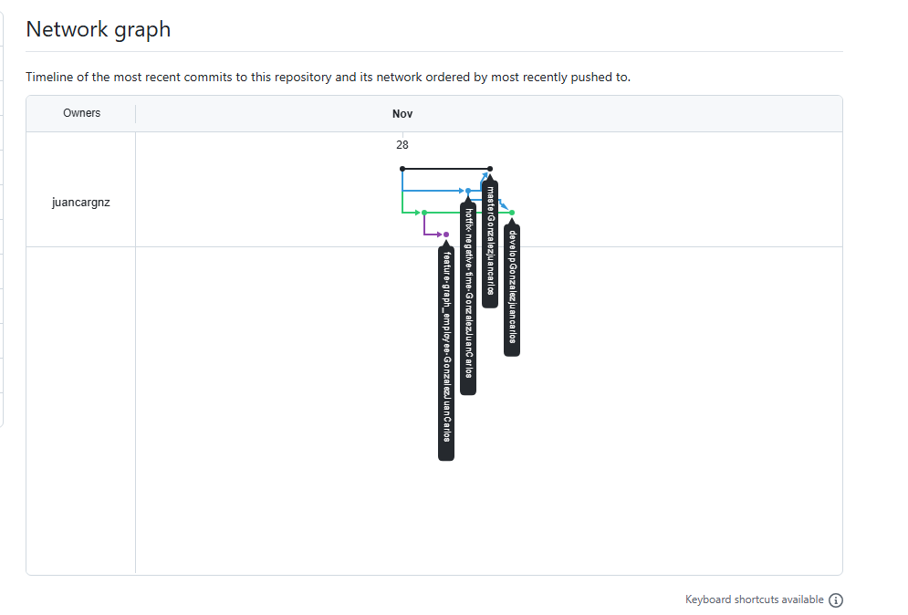

-C7 (task_type): Creación de una rama para añadir el tipo de tareas.

Primero cambiamos a develop y lo siguiente que hacemos es crear la rama feature-task_type.

Después creamos el archivo task_type.js para simular la nueva funcionalidad y por ultimo commit y subida de la rama.

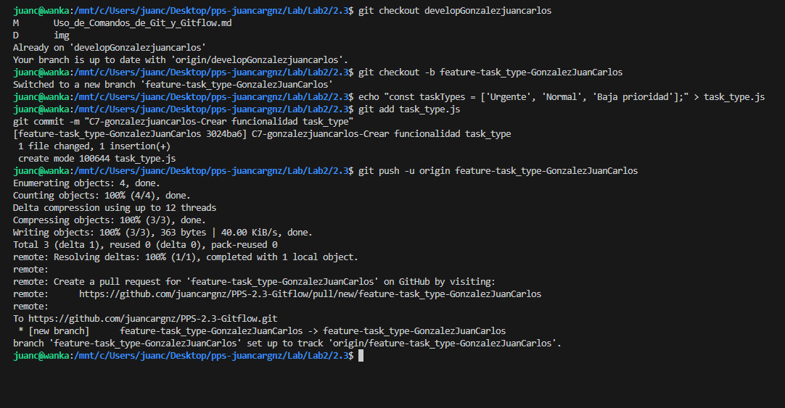
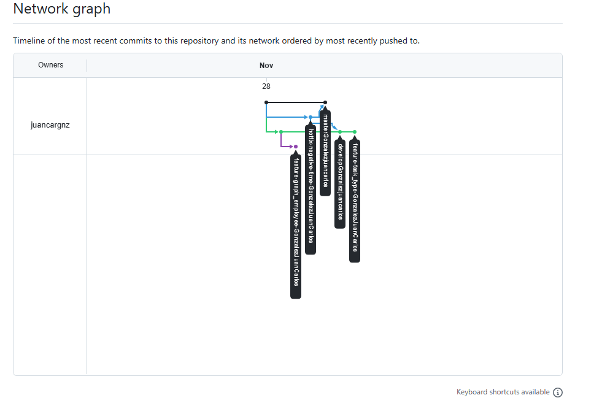

-C8 (graph_employee): Último commit de la rama graph_employee.

